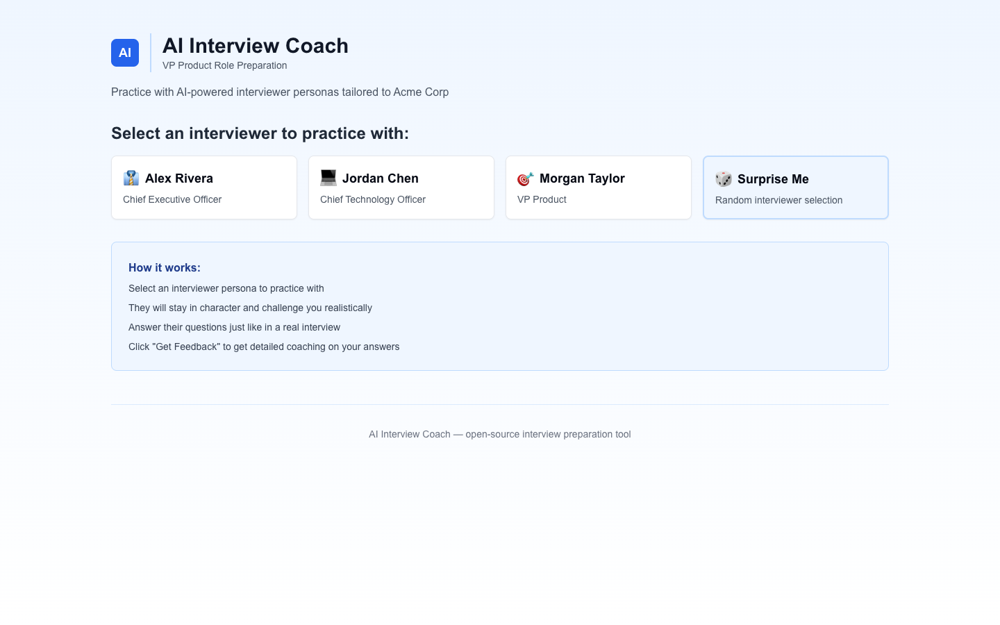

# AI Interview Coach

Generate realistic interviewer personas and practice with AI-powered conversations.



---

## How It Works

1. **Set up your coach** — run `npm run setup` and enter the company and role you are preparing for
2. **Customize your personas** — edit the markdown files in `personas/` to match the real people you will be interviewing with (or use the example templates as starting points)
3. **Practice** — select an interviewer and have a realistic conversation; switch to Feedback mode to get detailed coaching on your answers

The app runs two modes:

- **Practice mode**: The AI stays in character as the interviewer, asks probing questions based on their priorities, and challenges your answers based on their known red flags
- **Feedback mode**: The AI switches to coach mode and gives you specific, honest feedback on what landed, what triggered red flags, and how to reframe your weakest answers

---

## Quick Start

### Prerequisites

- Node.js 18+
- An Anthropic API key ([get one here](https://console.anthropic.com/))

### Install and run

```bash
# Clone the repo
git clone https://github.com/cla1redonald/ai-interview-coach.git
cd ai-interview-coach

# Install dependencies
npm install

# Run setup (configures company, role, and color theme)
npm run setup

# Add your API key
echo "ANTHROPIC_API_KEY=your-key-here" > .env.local

# Start the dev server
npm run dev
```

Open [http://localhost:3000](http://localhost:3000) to start practicing.

---

## Creating Custom Personas

Personas are markdown files in the `personas/` directory. The filename becomes the persona ID -- `Sarah_Johnson_CPO.md` becomes `sarah-johnson-cpo`.

### File format

```markdown
# Sarah Johnson - Chief Product Officer

## Strategic Priorities
- Bullet points about what this person cares about most

## Red Flags
- What turns them off in candidates

## Green Flags
- What they want to hear

## Communication Style
A paragraph about how they interview -- formal/casual, pace, what they probe on.

## Example Questions
1. Question they would likely ask
2. Another question
3. A third question
```

The first line (`# Name - Title`) is required -- it is how the app identifies the persona. Everything else shapes how the AI plays the character.

### Using the template

```bash
cp cli/persona-template.md personas/Your_Name_Role.md
```

Then edit the file with real research about the person.

### The research approach

The best personas come from research:

1. Search the company website, LinkedIn, and press coverage for the person
2. Find interviews, talks, or articles where they have shared their views
3. Look for patterns in what they value, what they have built, and what language they use
4. Translate that into specific red flags and green flags in the persona file

Specificity is everything. "Cares about outcomes" is useless. "Tracks 90-day retention cohorts and considers NPS below 45 a product failure" gives the AI something to work with.

---

## Tech Stack

- **Framework**: Next.js 14 (App Router), React 18
- **AI**: Claude Sonnet via Anthropic API (`@ai-sdk/anthropic`, `ai`)
- **Styling**: Tailwind CSS, shadcn/ui components
- **Testing**: Vitest
- **Deployment**: Vercel

---

## How I Built This

The insight behind this tool is that the quality of interview practice is almost entirely determined by how accurately the "interviewer" reflects the real person's priorities, values, and communication style. Generic mock interviews produce generic preparation. Persona-specific practice produces calibrated answers.

The persona creation process uses an AI research swarm approach: given a company and role, the system researches each interviewer — LinkedIn profiles, conference talks, company announcements, annual reports — and distils that into structured persona profiles covering strategic priorities, red flags (what makes them cautious about a candidate), and green flags (what genuinely excites them). Those profiles become system prompts that produce remarkably realistic interview simulations.

The two-mode architecture separates practice from coaching. In practice mode, the AI stays in character and challenges you based on the persona's known priorities. In feedback mode, it switches to coach and references the specific red flags and green flags from the persona profile, so the coaching is always grounded in what that specific interviewer cares about — not generic advice.

---

## Why This Exists

Most interview prep tools give you generic questions and generic feedback. The problem is that interviews are not generic -- they are shaped by the specific person across the table, what they have built, what they have failed at, and what they are trying to solve right now.

The persona-based approach closes that gap. When you practice with a well-researched persona, you stop rehearsing generic answers and start calibrating to the actual audience. That is the difference between sounding competent and sounding like the right person for this specific role at this specific company.

If you are going through an important hiring process, the 2-3 hours it takes to research and write good persona files is probably the highest-leverage interview prep you can do.

---

## License

MIT

---

## Contributing

PRs welcome. If you create good generic persona templates, please share them.
